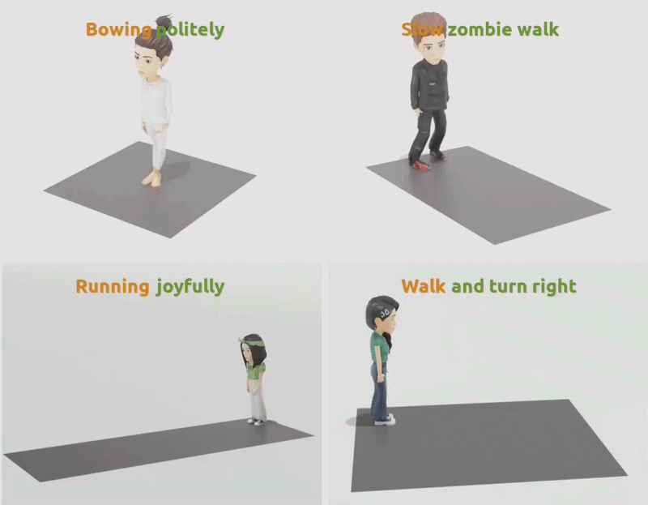
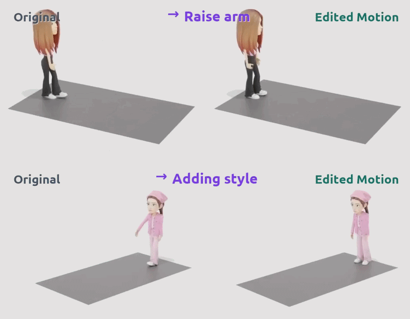

# ScaleMoGen (ECCV 2026)

<h3>Official PyTorch implementation of ScaleMoGen: Autoregressive Next-Scale Prediction for Human Motion Generation.</h3>

<p align="center">
  <a href="https://woo0818.github.io/ScaleMoGen/">
    
  </a>
  <a href="https://arxiv.org/abs/2605.11704">
    
  </a>
</p>

TL;DR: ScaleMoGen is a next-scale token-map prediction framework built on a multi-scale skeletal-temporal hierarchy for human motion generation and zero-shot motion editing.

## Motion Generation and Zero-Shot Editing

<table width="100%" border="0" cellspacing="0" cellpadding="0">
  <tr>
    <td align="center" width="50%" valign="top">
      <strong>Motion Generation</strong><br>
      <a href="https://woo0818.github.io/ScaleMoGen/">
        
      </a>
    </td>
    <td align="center" width="50%" valign="top">
      <strong>Zero-Shot Motion Editing</strong><br>
      <a href="https://woo0818.github.io/ScaleMoGen/">
        
      </a>
    </td>
  </tr>
</table>

## Environment

Create a clean conda environment from the repository root:

```bash
conda create -n scalemogen python=3.10 pip -y
conda activate scalemogen
```

Install PyTorch 2.0.1 with CUDA 11.7 first:

```bash
pip install torch==2.0.1+cu117 torchvision==0.15.2+cu117 --extra-index-url https://download.pytorch.org/whl/cu117
```

Then install the remaining Python dependencies and CLIP:

```bash
pip install -r requirements.txt
pip install git+https://github.com/openai/CLIP.git
```

Make sure the NVIDIA driver on your machine supports CUDA 11.7 runtime
packages. Motion rendering has been tested with `matplotlib==3.3.4`; newer
versions may produce different 3D animation outputs. Install `ffmpeg` separately
if you want to render videos:

```bash
conda install -c conda-forge ffmpeg
```

## Repository Layout

```text
config/                  Training and evaluation configs
dataset/                 SnapMoGen and HumanML3D dataset loaders
model/evaluator/         Text-motion evaluator wrappers
scalemogen/              ScaleMoGen tokenizer, predictor, training, and runtime modules
tools/run_scalemogen.py  Shared generation helper
utils/                   Motion processing, metrics, plotting, BVH, and text utilities
prepare/                 Dataset, evaluator, and GloVe preparation scripts
```

The main entrypoints are:

```text
train_vq.py
train_scalemogen_predictor.py
eval_scalemogen.py
eval_vq.py
gen_scalemogen.py
edit_scalemogen.py
```

## Data and Checkpoints

Datasets and checkpoints are not included in the source tree. Place them under
the following paths, or edit the paths in the config files.

Pretrained ScaleMoGen checkpoints are available on
[Hugging Face](https://huggingface.co/inwoohwang0818/ScaleMoGen). Place the
downloaded files under `checkpoint_dir/` using the layout below.

Large runtime assets such as datasets, evaluator checkpoints, pretrained
checkpoints, downloaded GloVe files, and dataset prompt files are ignored by
git.

Dataset setup follows the
[SnapMoGen repository](https://github.com/snap-research/SnapMoGen). The
SnapMoGen dataset can be downloaded from
[Hugging Face](https://huggingface.co/datasets/Ericguo5513/SnapMoGen):

```bash
pip install huggingface_hub
bash prepare/download_datasets.sh
```

SnapMoGen:

```text
data/SnapMoGen/
  renamed_feats/
  renamed_bvhs/
  meta_data/mean.npy
  meta_data/std.npy
  data_split_info1/{train,val,test}_fnames.txt
  data_split_info1/{train,val,test}_ids.txt
  all_caption_clean.json
```

HumanML3D:

Follow the official [HumanML3D](https://github.com/EricGuo5513/HumanML3D)
instructions, then copy or symlink the processed dataset to:

```text
data/HumanML3D/
  new_joint_vecs/
  texts/
  train.txt
  val.txt
  test.txt
```

Evaluation assets:

We follow the evaluator setup from the
[SnapMoGen repository](https://github.com/snap-research/SnapMoGen). Download
the evaluator checkpoints and GloVe files using the provided prepare scripts:

```bash
pip install gdown
bash prepare/download_evaluators.sh
bash prepare/download_glove.sh
```

Evaluator files are expected under `checkpoint_dir/<dataset>/`.

```text
checkpoint_dir/snapmogen/evaluator/eval_klde-5_late-5_nlayer6_norm/
  evaluator.yaml
  model/net_best_top1.tar

checkpoint_dir/humanml3d/Comp_v6_KLD005/
  opt.txt
  meta/mean.npy
  meta/std.npy

checkpoint_dir/humanml3d/text_mot_match/model/finest.tar
```

The downloaded ScaleMoGen checkpoints should follow the layout expected by the
configs:

```text
checkpoint_dir/<dataset>/vq/<vq_name>/
  train_vq*.yaml
  model/<vq_checkpoint>

checkpoint_dir/<dataset>/predictor/<exp_name>/
  train_scalemogen_predictor*.yaml
  model/<predictor_checkpoint>
```

## Training

SnapMoGen:

```bash
python train_vq.py --config config/train_vq.yaml
python train_scalemogen_predictor.py --config config/train_scalemogen_predictor.yaml
```

HumanML3D:

```bash
python train_vq.py --config config/train_vq_hml.yaml
python train_scalemogen_predictor.py --config config/train_scalemogen_predictor_hml.yaml
```

## Evaluation

VQ reconstruction:

```bash
python eval_vq.py --config config/eval_vq.yaml
python eval_vq.py --config config/eval_vq_hml.yaml
```

Text-to-motion generation metrics:

```bash
python eval_scalemogen.py --config config/eval_scalemogen.yaml
python eval_scalemogen.py --config config/eval_scalemogen_hml.yaml
```

The evaluation configs use deterministic data loading, FP32 T5 text encoding,
and `use_bf16: false` by default for cross-device reproducibility.

## Generation

SnapMoGen test split:

```bash
python gen_scalemogen.py --config config/eval_scalemogen.yaml --mode test
```

HumanML3D test split:

```bash
python gen_scalemogen.py --config config/eval_scalemogen_hml.yaml --mode test
```

## Editing

Example using a SnapMoGen editing preset:

```bash
python edit_scalemogen.py --config config/eval_scalemogen.yaml --preset dance_exaggerated
```

## Notes

- `text_encoder_dtype: "fp32"` is the default for evaluation and generation.
- Set `text_encoder_device: "cpu"` in an eval config to reduce VRAM use. This
  keeps FP32 text features but runs T5 encoding more slowly.
- `use_bf16: false` is the default because bf16 predictor inference can change
  sampled token indices across GPU types.
- `sampling_device: "cuda"` is the default because it matched CPU sampling in
  our cross-device trace tests while avoiding unnecessary CPU transfer overhead.

## Acknowledgements

We sincerely thank the authors of the following open-source projects, upon
which our code is built:

- [SnapMoGen](https://github.com/snap-research/SnapMoGen)
- [VAR](https://github.com/FoundationVision/VAR)
- [Infinity](https://github.com/FoundationVision/Infinity)

## Citation

If you find our code or paper helpful, please consider citing the following:

```bibtex
@misc{hwang2026scalemogenautoregressivenextscaleprediction,
      title={ScaleMoGen: Autoregressive Next-Scale Prediction for Human Motion Generation},
      author={Inwoo Hwang and Hojun Jang and Bing Zhou and Jian Wang and Young Min Kim and Chuan Guo},
      year={2026},
      eprint={2605.11704},
      archivePrefix={arXiv},
      primaryClass={cs.CV},
      url={https://arxiv.org/abs/2605.11704},
}
```
